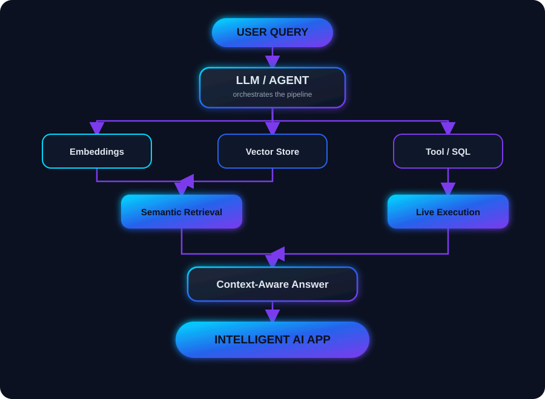

<!-- ========================================================= -->
<!--                    PROFILE HEADER                         -->
<!-- ========================================================= -->

<div align="center">


<br>


<br><br>

<a href="https://www.linkedin.com/in/purushothaman-p-6436a228a/">

</a>
<a href="https://purushoth-a-man-portfolio.vercel.app/">

</a>
<a href="mailto:">

</a>

<br><br>


</div>

<br>

<!-- ========================================================= -->
<!--                       ABOUT ME                            -->
<!-- ========================================================= -->

## 🧠 About Me

<div align="center">
<table>
<tr><td>

| | |
|---|---|
| 🧑‍💻 **Name** | Purushothaman P |
| 🎯 **Role** | Aspiring AI/ML Engineer |
| 🎓 **Education** | B.E. Artificial Intelligence & Machine Learning — AMC Engineering College (CGPA 8.45/10) |
| 🔬 **Focus** | Generative AI · RAG · LLM Applications · Computer Vision · Agentic AI |
| 🛠️ **Currently Building** | Voice agents, RAG pipelines, and end-to-end AI applications |
| 🔍 **Looking For** | Entry-level AI/ML & Generative AI opportunities |
| 💡 **Philosophy** | Learn → Build → Deploy → Improve |

</td></tr>
</table>
</div>

- 🎓 Final-year **AI & ML** engineering student, turning coursework into shipped products
- 🎙️ Team lead on **Voxmate**, a KSCST-funded AI voice assistant project
- 🤖 Deep focus on **RAG, LangChain, FAISS, vector search**, and LLM-powered applications
- 👁️ Comfortable across the stack — **Python, React/Node, Flutter**, and cloud deployment
- 🔍 Actively seeking an **entry-level AI/ML Engineer** role

<br>

<!-- ========================================================= -->
<!--                     TECH STACK                            -->
<!-- ========================================================= -->

## ⚡ Tech Stack

<div align="center">

**Languages**
<br>


<br><br>

**AI / Machine Learning**
<br>


<br><br>

**Web & Backend**
<br>


<br><br>

**Databases**
<br>


<br><br>

**Mobile**
<br>


<br><br>

**Tools & Deployment**
<br>


</div>

<br>

<!-- ========================================================= -->
<!--                  GEN AI PIPELINE DIAGRAM                   -->
<!-- ========================================================= -->

## 🤖 Generative AI Focus

<div align="center">


</div>

<div align="center">

</div>

<br>

<!-- ========================================================= -->
<!--                    FEATURED PROJECTS                      -->
<!-- ========================================================= -->

## 🚀 Featured Projects

<table>
<tr>
<td width="50%" valign="top">

### 🎙️ [Voxmate — AI Voice Assistant](https://github.com/MARVEL420-CODE/Voxmate_on_live)
**Team Lead · KSCST Funded (Ref: 49S_BE_3509)**

Conversational AI voice assistant with facial authentication and IoT-based smart device control. Modular architecture supports 10+ voice command categories with MQTT integration for real-time home automation.

`Python` `PyTorch` `OpenCV` `MQTT` `Flask`

</td>
<td width="50%" valign="top">

### 📄 [PDF RAG Chatbot](https://github.com/MARVEL420-CODE/PDF-RAG-BOT)
**Personal Project**

Retrieval-Augmented Generation chatbot for intelligent PDF Q&A. Implements text chunking, embeddings, and semantic search with FAISS, paired with LLM-powered context-aware responses.

`Python` `LangChain` `OpenAI` `FAISS`

</td>
</tr>
<tr>
<td width="50%" valign="top">

### 📊 [The Ledger — AI CSV Data Q&A Agent](https://github.com/MARVEL420-CODE/The-Ledger---CSV-Data-Q-A-Agent-)
**Full-Stack AI Project**

Natural language → SQL → execution → natural language answer pipeline. Dynamic schema detection, safe read-only SQL execution, CSV upload, and real-time result visualization.

`React` `Vite` `Node.js` `Express` `Gemini` `SQL.js`

</td>
<td width="50%" valign="top">

### 🏡 House Price Prediction
**End-to-End ML Project**

Full pipeline from synthetic data generation to a deployed Streamlit app — modular preprocessing, XGBoost modeling, and an evaluation report packaged for reproducibility.

`Python` `XGBoost` `Streamlit` `Pandas`

</td>
</tr>
</table>

<br>

<!-- ========================================================= -->
<!--                   EXPERIENCE TIMELINE                      -->
<!-- ========================================================= -->

## 💼 Experience

```text
Feb 2026 ─ May 2026   Python Full Stack Trainee, Besant Technologies
                      ↳ Vehicle Rental Management System — Flask + MySQL, REST APIs

Dec 2025 ─ Feb 2026   Android Development Intern, Vayu Aarambh Innovation Pvt Ltd
                      ↳ AQI monitoring app in Flutter — live OpenAQ data, real-time charts

Sep 2025 ─ Dec 2025   Machine Learning Intern, Unified Mentor
                      ↳ Supervised/unsupervised models, EDA & preprocessing pipelines
```

<br>

## 📜 Certifications

<div align="center">


</div>

<br>

<!-- ========================================================= -->
<!--                       GITHUB STATS                         -->
<!-- ========================================================= -->

## 📊 GitHub Stats

<div align="center">


<br>


<br>


<br>

<!-- ========================================================= -->
<!--                        CONNECT                             -->
<!-- ========================================================= -->

<div align="center">

## 🤝 Let's Connect

I'm actively looking for **entry-level AI/ML & Generative AI roles** — always open to a chat about agentic systems, RAG pipelines, or anything AI.

<a href="https://www.linkedin.com/in/purushothaman-p-6436a228a/">

</a>
<a href="https://purushoth-a-man-portfolio.vercel.app/">

</a>

<br><br>


</div>
